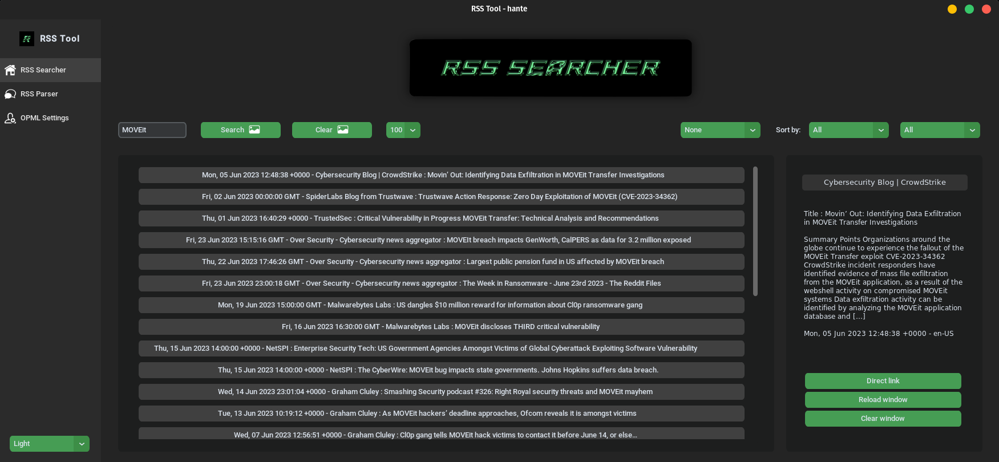
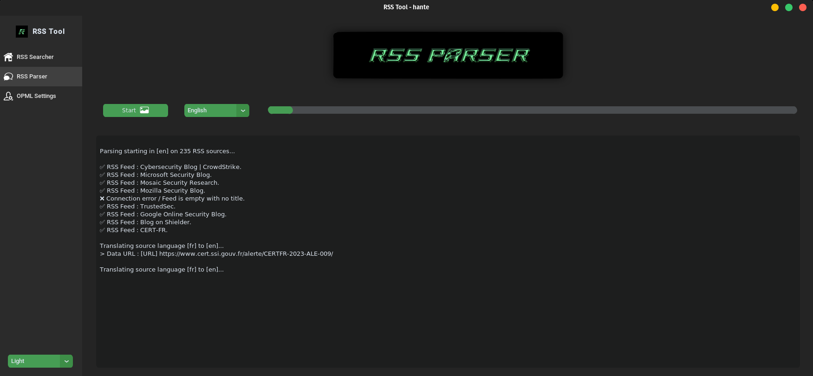
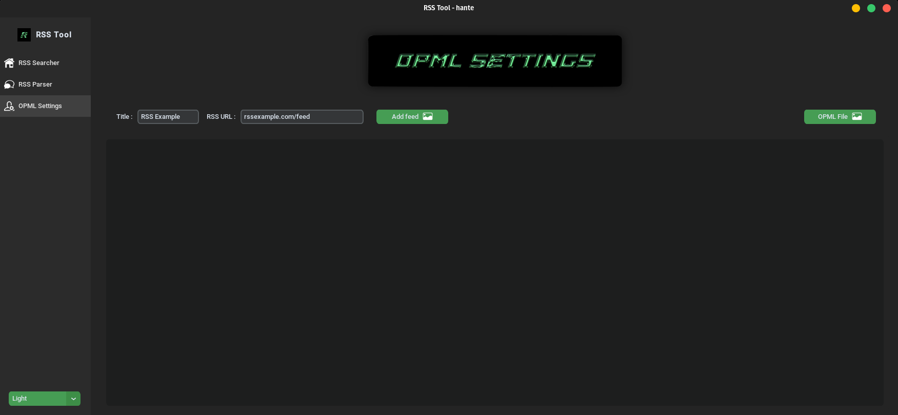

# RSS Tool

The RSS Tool is a python project dedicated to the extraction and storage of data from RSS feeds and is designed to monitor the latest news about cybersecurity (malwares, hacks, exploits...).

## Run Locally

Clone the project

```bash
  git clone https://github.com/hanteed/RSS-tool
```

Go to the project directory

```bash
  cd RSS-tool
```

Install the dependencies with pip3

```bash
  pip3 install -r requirements.txt
```

Run the code

```bash
  python3 main.py
```


## Documentation

The project aims at gathering data from multiple RSS feeds in a single SQL database in order to easily search for the latest security news about a specific subject. The RSS feeds are saved inside an OPML file inside data/rssstreams.

The project works with a gui built with [customtkinter](https://github.com/TomSchimansky/CustomTkinter). The interface is designed to be intuitive and reactive. There are 3 main tabs in which you can do several things :
* RSS Searcher : this tab allows you to search for a specific item inside the database. You can : search, clear the results, limit the number of results, translate the content of the active result to another language, sort the results by date / initial language. When clicking on an item, a tab will be created at the right of your screen, here you can go on the original article by clicking on the "Direct link" button. You can also reload the window if by the time you have changed the translation language to another. You can also clear the tab if you wish to.

* RSS Parser : this tab allows you to fetch and save all the new data from the RSS feeds inside the OPML file you have chosen. You can choose if the content directly needs to be translated in another language or not. 

* OPML Settings : this tab acts like a settings tab. It allows you to add a new RSS feed to the current OPML file or change the current OPML file you use (it can be useful if you want to use files you downloaded from the web). Note that some files may not work due to their specific structure.
## Features

- Light/dark mode toggle
- AI translation
- Fullscreen mode
- Cross platform
- Threading


## Screenshots







